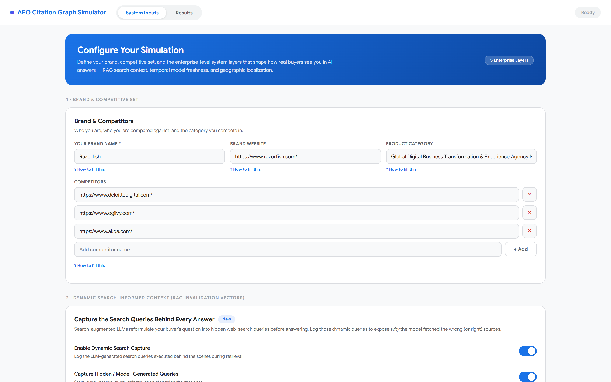
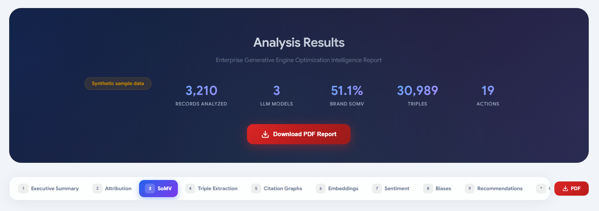

# AEO & LLM Citation Graph Simulator (v2.1) — Open Audit Lab for AI Search Visibility

**AEO (Answer Engine Optimization) + GEO (Generative Engine Optimization): grounded-only Share of Voice, per-engine citation adapters, volatility CIs, and tamper-evident provenance — local-first, against live 2026 LLM APIs.**

<p>
  <a href="https://github.com/dipakjad1993/AEO-LLM-Citation-Graph-Simulator/actions/workflows/ci.yml"></a>
  
  
  
  
  
  
</p>

> **Live demo (hosted):** https://aeo-llm-citation-graph-simulator-1.onrender.com/ — try it in your browser, no install.
> For private tracking, deploy your own instance, set `AEO_AUTH_TOKEN` plus provider keys (see Quickstart B).
>
> **Source:** https://github.com/dipakjad1993/AEO-LLM-Citation-Graph-Simulator — issues and PRs welcome.

**Positioning: if Profound is the Bloomberg Terminal for AI visibility ($1B valuation, $99-$399+/mo), this is the open audit lab.**
Profound, Scrunch/Sitecore (~$225M), Peec (EUR 70-360/mo), and Goodie ($399/mo) sell you scores.
This tool shows you the receipts: the exact responses, citations, browse-evidence flags, volatility intervals,
and tamper-evident manifests behind every metric — running on your machine, against live 2026 model APIs,
for about $0.245 per question x 6 engines (Stork.AI-measured reference).

> **2-minute, $0, zero-key proof of value:**
> ```bash
> npm install && pip install -r requirements-lite.txt
> python -m spacy download en_core_web_sm
> npm run demo   # keyless demo_synthetic corpus -> Stage 0 + 14 stages -> dashboard + recommendations
> ```
> Demo rows are labelled `demo_synthetic`, written to `data/output/run_demo_synthetic_QUARANTINED/`,
> and quarantined from prod analysis by default (the demo runner opts in via `AEO_ALLOW_SYNTHETIC=1` only).
> Any other `run_*` dir containing synthetic rows **fails loud** instead of silently polluting SoMV.
> The dashboard renders a red `SYNTHETIC - NOT PROD EVIDENCE` banner on quarantine runs.




## Why teams pick this (the moat — covered by eval goldens, do not regress)

| # | Capability | What it means |
|---|---|---|
| 1 | **Grounded-only SoMV** | `search_requested` vs `search_performed` split; SoMV recomputed on browse-evidenced rows only, Wilson 95% CIs, `LOW_BROWSE_RATE` (<50%) and `BELOW_BENCHMARK_74` flags |
| 2 | **Per-engine citation adapters** | OpenAI `annotations[]`/`sources[]`, Anthropic `web_search_tool_result` (UTM-strip), Gemini redirect resolver (HEAD + Range fallback), Perplexity flat `citations[]`, `search_contaminated_baseline` flag on RAG-off twins |
| 3 | **No fabrication, ever** | Missing text -> `success:false + unusable_reason`; absent inputs -> `status:no_data` + schema spec. Guarded by 12 eval goldens |
| 4 | **CPR + G_auth + parity** | Multi-turn Citation Persistence Rate, `G_auth = 0.4*C_D + 0.35*C_B + 0.25*S_cons`, API/UI parity flag at >15% variance (Playwright is a <=15% control group only) |
| 5 | **Tamper-evident provenance** | SHA-256 run manifest + append-only JSONL audit + PII redact/hash-only mode. Verify: `python scripts/verify_manifest.py data/output/<run>` |
| 6 | **Cost honesty** | ~$0.245/question x 6 engines, $500/day hard budget, `max_calls_per_run:2500`, Grok `search_cost` preserved and billed, cost-flat multi-country geo |

Methodology detail: [`docs/methodology.md`](docs/methodology.md) (read before changing analytics).

## Quickstart

| Path | Command | Notes |
|---|---|---|
| A. Keyless demo | `npm run demo` | Synthetic, quarantined (see above). Mirrors CI |
| B. Real tracking | `node setup.js` then `npm run full-run` | Validates each key live; enforces Python >=3.11; needs 1+ provider key |
| C. Server UI/API | `AEO_AUTH_TOKEN=... node server.js` | `http://localhost:3000`, probe `/api/health` |
| D. Docker | `docker compose up --build` | Sets `HOST=0.0.0.0` for you |
| E. Static preview (Cloudflare Pages) | Framework preset None, empty build command, output dir = repo root | Landing + inputs shell only (no `/api/*` backend); shows a "Static preview" banner. Full runs need C/D |

> Pages note: this repo is a Node + Python app, not a static site — Pages can only host the
> dashboard shell (`_redirects` maps `/` to `src/dashboard/index.html`). Live analysis, uploads,
> and results need the `server.js` backend (paths C/D) or the hosted demo above.

Provider keys: OpenAI, Anthropic, Google, Perplexity, DeepSeek, xAI (`XAI_API_KEY`), SERP (`SERP_API_KEY` + `SERP_PROVIDER=serper|dataforseo|zenserp`).

## What you get (2026-enterprise feature set)

- **Stage 0 Commerce preflight + full Commerce Truth:** feed health, GTIN/price/availability/`image_link` impact simulator, ACP `checkout_eligibility` probe (`node scripts/acp_probe.js --cron`), Shopify UCP `native_commerce` badge, publishable fix assets (`product_offer.jsonld` + `merchant_feed_fix.csv`)
- **Traffic join with revenue proof:** one-click importers (`python scripts/import_traffic.py --gsc g.csv --ga4 g.csv --bing b.csv` for GSC/GA4/Bing AI Performance), generative-inclusion gate, AI-referrer revenue share, `/api/export?format=csv` + Looker Studio template (`docs/looker_studio_template.json`)
- **Snippet fail gate (P0, Google May-15 Guide):** `nosnippet`/`max-snippet:0`/`data-nosnippet` detection, score 0 + Slack alert + HIGH recommendation; CI gate: `python scripts/snippet_gate.py https://example.com/pricing`
- **90-day trends (SQLite, not JSON):** `analytics/trend_store.py` -> `data/trends.db`, served at `/api/trends?days=90`; scheduler diffs latest-vs-previous for Slack (SoMV drop >15%, competitor surge >15%, hallucination spike, CPR <50%, snippet-blocked, volatility HIGH)
- **Third-party dominance engine:** live earn/edit/respond scoring per citing URL, owner + pitch draft, top-10 `missing_authority_nodes`, `reports/outreach_briefs/*.md`
- **Agent readiness done right:** MCP/WebMCP 35% + live tool-call e2e (`python scripts/mcp_tool_test.py <site>`), ACP 25%, basics 25%, `llms.txt` 15% experimental (NOT a Google ranking factor)
- **Geo matrix that doesn't lie:** cost-flat budget split across `geo.countries`, `location_code` rows, EU-vs-US split, per-locale GBP/`LocalBusiness` checklist
- **Remediation + benchmark:** `python scripts/remediation_pr.py --analysis ... [--apply]` (GitHub PR with fixed JSON-LD + `dateModified`), `node scripts/benchmark_pack.js` (Stork-style grounded-rate reference), `python scripts/refresh_tickets.py` (Jira/Linear refresh tickets)
- **Freshness enforcement:** ChatGPT/Perplexity ~30d, Claude ~quarter, AIO ~year windows with auto-tickets

Pipeline: **Stage 0 Commerce preflight** -> 14 stages (attribution, triples, verification, graphs, SoMV, embeddings, sentiment, enterprise/CPR, site audit, agent readiness, volatility, third-party/geo, commerce+traffic, dashboard, recommendations) -> SQLite trends + Slack alerts.

## Security posture (framework-free `server.js`, enterprise-ready)

- 25 MB body cap, constant-time token compare, traversal blocks, allow-listed static, 60 req/min/IP (`MAX_IPS:5000` eviction); `NODE_ENV=production` refuses to boot without `AEO_AUTH_TOKEN`
- CORS allow-list: `AEO_CORS_ORIGIN=https://app.example.com` (comma-separated). `*` is dev-only and logs a boot warning
- Correlation IDs (`x-request-id` echoed, file+OTLP JSONL via `OTEL_ENABLED=1`), persistent jobs (`data/jobs/jobs.json` + SQLite), audit chain (`GET /api/audit`), posture (`GET /api/security`), trends (`GET /api/trends`)
- SSO/RBAC: `AEO_OIDC_ISSUER/AUDIENCE/JWKS_URL` + `config/security.json` (`admin|analyst|viewer`); see [`docs/enterprise.md`](docs/enterprise.md)

## Docs (deep dives)

- [`docs/methodology.md`](docs/methodology.md) — grounded SoMV, adapters, CPR/G_auth/parity, provenance, cost, volatility
- [`docs/providers.md`](docs/providers.md) — 2026 registry, unverified late-2026 candidates + nightly verifier, Playwright parity-only + ToS warning, SERP surfaces
- [`docs/enterprise.md`](docs/enterprise.md) — security, jobs, trends, snippet gate, commerce, traffic, outreach, geo, agent readiness, PR mode, benchmark, Lite-vs-Full

## Tests & verification (these are the CI gates — keep them green)

```bash
node --test src/node-orchestrator/utils/unitTests.js   # 18 adapter/provenance/quality tests
python src/python-engine/tests/test_eval_goldens.py    # 12 no-fabrication/methodology goldens
python src/python-engine/tests/test_verification.py    # claim-verification checks
npm run validate                                       # LOCAL readiness gate (needs .env + real brand; not CI)
python scripts/verify_manifest.py data/output/<run>   # provenance check
node scripts/verify_model_registry.js                  # provider-ID drift (add --strict in CI/cron)
```

Python: `requirements-lite.txt` is the default (~200 MB, MiniLM/keyword + VADER fallbacks); `requirements.txt` adds torch/transformers/UMAP/HDBSCAN. Pinned in `uv.lock` / `requirements.lock.txt`. Requires Python >=3.11. The dashboard badges `Lite mode: transformer sentiment OFF` whenever heavy ML is absent, so VADER is never mistaken for RoBERTa.

## Contributing

PRs welcome at https://github.com/dipakjad1993/AEO-LLM-Citation-Graph-Simulator. Keep the moat green:
`docs/methodology.md` first, fixture-first for adapter changes, `AEO_ALLOW_SYNTHETIC` quarantine intact,
and `node --test ...unitTests.js` + `test_eval_goldens.py` passing before you push.
