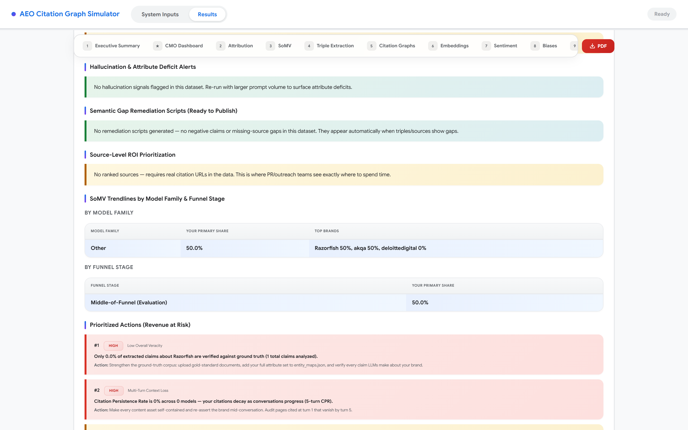
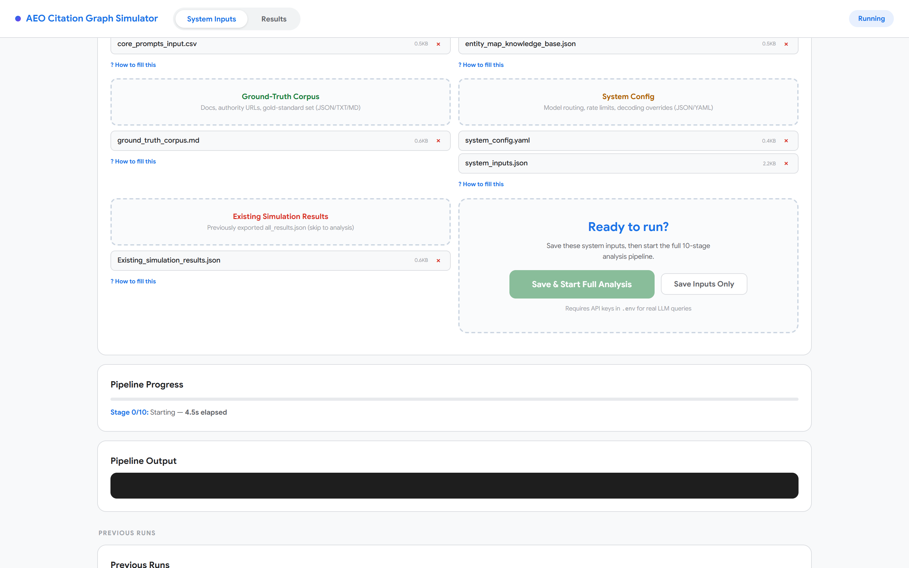
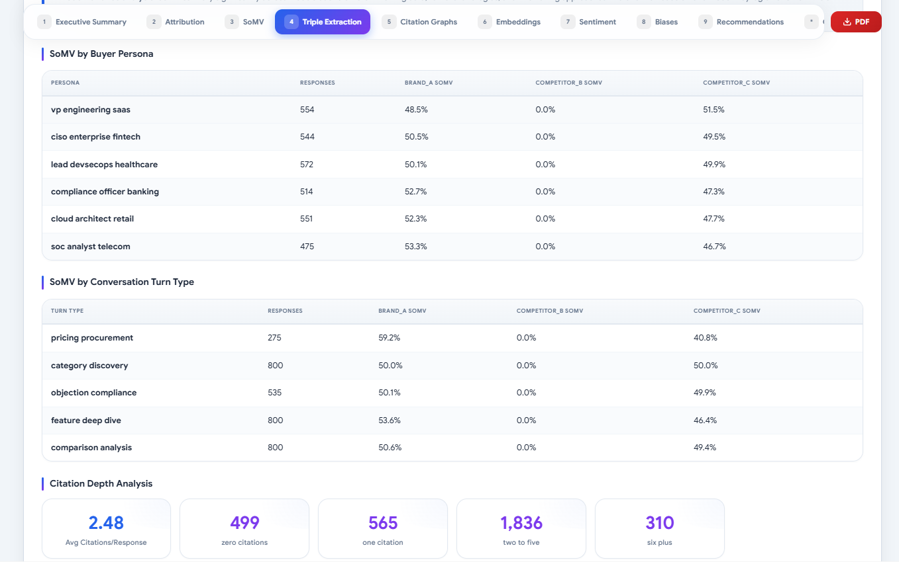
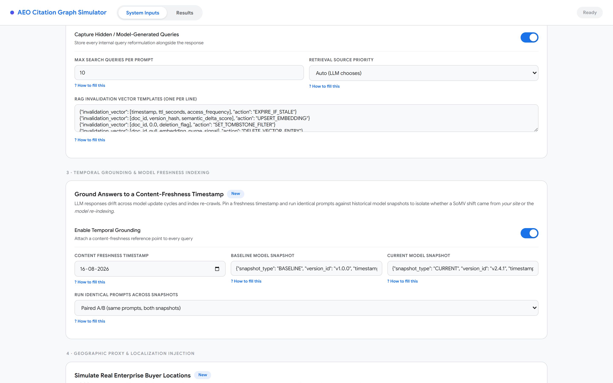

# AEO & LLM Citation Graph Simulator — v2.0

### The open, auditable, technical-SEO source of truth for AI search. Local-first. No black boxes. Every number traces to a real response.

<p>
  
  
  
  
  
  
  
</p>

**If Profound is the Bloomberg Terminal for AI visibility ($1B valuation, $99–$399+/mo), this is the open audit lab.**
Profound, Scrunch (acquired by Sitecore ~$225M, June 2026), Peec (€70–€360/mo, ~$10M ARR), and Goodie ($399/mo)
sell you scores. This tool shows you the *receipts*: the exact responses, citations, browse-evidence flags,
robots rules, volatility intervals, and tamper-evident manifests behind every metric — running on your machine,
against live 2026 model APIs, for the price of API tokens (~24.5¢ per question × 6 engines).

> **2-minute, $0, zero-key proof of value:**
> ```bash
> npm install && pip install -r requirements-lite.txt
> python -m spacy download en_core_web_sm
> npm run demo   # seeds 168-row synthetic corpus → runs all 14 stages → dashboard + 34 recommendations
> ```


---

## Table of contents

1. [Why this exists (the 2026 competitive reality)](#1-why-this-exists-the-2026-competitive-reality)
2. [What you get: capability map](#2-what-you-get-capability-map)
3. [Quickstart (3 paths: demo, real, docker)](#3-quickstart-3-paths-demo-real-docker)
4. [How it works: architecture & data flow](#4-how-it-works-architecture--data-flow)
5. [Provider & model registry (2026)](#5-provider--model-registry-2026)
6. [Citation adapters: per-engine extraction truth](#6-citation-adapters-per-engine-extraction-truth)
7. [Methodology honesty: grounded-only SoMV, volatility, no fabrication](#7-methodology-honesty-grounded-only-somv-volatility-no-fabrication)
8. [The 14-stage analytics pipeline, stage by stage](#8-the-14-stage-analytics-pipeline-stage-by-stage)
9. [Site auditor: technical SEO truth for AI surfacing](#9-site-auditor-technical-seo-truth-for-ai-surfacing)
10. [Agent readiness (done right): llms.txt, MCP/WebMCP, UCP, ACP](#10-agent-readiness-done-right-llmstxt-mcpwebmcp-ucp-acp)
11. [Third-party dominance, geo & temporal tracking](#11-third-party-dominance-geo--temporal-tracking)
12. [Scheduler, volatility repeats & Slack alerts](#12-scheduler-volatility-repeats--slack-alerts)
13. [Configuration reference](#13-configuration-reference)
14. [Server & dashboard guide](#14-server--dashboard-guide)
15. [Cost engineering: the 24.5¢ math](#15-cost-engineering-the-245-math)
16. [Security model](#16-security-model)
17. [Testing, eval goldens & CI](#17-testing-eval-goldens--ci)
18. [Head-to-head: vs Profound / Scrunch / Peec / Goodie / budget tools](#18-head-to-head-vs-profound--scrunch--peec--goodie--budget-tools)
19. [Roadmap](#19-roadmap)
20. [Troubleshooting & FAQ](#20-troubleshooting--faq)
21. [Repository map](#21-repository-map)

---

## 1. Why this exists (the 2026 competitive reality)

AI search referral traffic converts at up to **11x** traditional search (Goodie, 31M-citation study). The
category tracking it is now worth $1B+:

| Incumbent | Price | Moat | Their blind spot you exploit |
|---|---|---|---|
| **Profound** ($96M Series C, $1B val, 700+ enterprise) | $99/mo starter → enterprise 9–10 engines | Enterprise trust: SOC2/SSO, agents action layer | Hides grounded-vs-memory; no open audit trail |
| **Scrunch** (Sitecore ~$225M, Jun 2026) | $250/mo Core | Coverage (7 engines) + site audits bundled | No CPR, no parity calibration, no graphs |
| **Peec AI** ($29.1M raised, ~$10M ARR, 2,500+ teams) | €70–€360/mo | Unlimited seats, daily tracking, multi-country | Monitoring-only; generates zero fixes |
| **Goodie** | $399/mo Explorer | Closed-loop research→revenue proof | Doesn't hand you publishable remediation assets |
| **Otterly $29 / HubSpot free / Semrush / Ahrefs / SE Ranking** | bottom-up | Cheap, instant | Shallow: no attribution split, no volatility, no provenance |

**This repo's winning position: "open, auditable, technical SEO truth."** The differentiators no open-source
competitor combines: **CPR** (multi-turn citation persistence) + **G_auth** graph authority scoring +
**API/UI parity calibration** + **tamper-evident provenance** + **grounded-only honesty** + **auto-generated
JSON-LD remediation assets**. Lean into trust; beat vendors by *showing what they hide* (ungrounded answers,
answer volatility, crawler-door misconfigurations).




---

## 2. What you get: capability map

**Collect (Node orchestrator — 9 collection paths)**
- GPT-5.5 via **Responses API** (`web_search` tool, `tool_choice`, `allowed_domains`, full `sources[]`),
  GPT-5 Search API via Chat Completions, Claude 4 Sonnet/Opus (`web_search_20250305` tool),
  Gemini 2.5 Pro / 3 Flash (grounding + **Google-redirect resolution**), Perplexity Sonar Pro
  (authoritative flat `citations[]`), DeepSeek V3 (memory baseline), **Grok 4** (xAI, self-reported search
  cost preserved), **Copilot + Google AI Overviews / AI Mode via SERP API** (Serper / DataForSEO / Zenserp),
  Playwright web-UI (opt-in parity control group), and a keyless **Demo provider**.
- Dual-query **attribution split** (RAG-on vs RAG-off twins), volatility repeat engine (money prompts × 5),
  token-level cost tracking with hard $500/day budget enforcement, rate limiting per provider,
  retry-with-backoff, live citation HTTP verification, and per-result **provenance records** hashed into an
  immutable run manifest + append-only audit log.

**Analyze (Python — 14 stages, zero fabricated values)**
1. Attribution classification (RAG vs base) · 2. Semantic triple extraction (passage-level) ·
3. Ground-truth claim verification · 4. Four citation graphs (citation, co-occurrence, entity-citation,
model-comparison) with PageRank/betweenness/Louvain · 5. **SoMV + grounded-only SoMV** (mention rate,
primary-recommendation rate, omission rate, RAG-vs-base delta, citation depth, competitive gaps,
browse-rate-by-model) · 6. Embeddings (MiniLM default, lazy) · 7. Sentiment & hallucination matrix ·
8. Enterprise (parity, **CPR**, **G_auth**, 3-door robots, source ROI, JSON-LD remediation, funnel trendlines) ·
9. **Site audit** · 10. **Agent readiness** · 11. **Volatility** (Wilson CIs) · 12. **Third-party/geo-temporal** ·
13. Dashboard · 14. Recommendations (every module emits prioritized, costed actions).

**Act**
- Publishable **FAQ/Product/Article JSON-LD + Markdown** remediation drafts per negative/contradicted claim,
  authority-outreach briefs per missing source, site-audit fix lists, refresh cadences, scheduler + Slack
  alerts (SoMV drop >15%, competitor surge, hallucination spike, CPR collapse).




---

## 3. Quickstart (3 paths: demo, real, docker)

### Path A — Keyless demo (2 minutes, $0)

```bash
git clone https://github.com/dipakjad1993/AEO-LLM-Citation-Graph-Simulator.git
cd AEO-LLM-Citation-Graph-Simulator
npm install
pip install -r requirements-lite.txt
python -m spacy download en_core_web_sm
npm run demo
# → seeds data/output/run_demo (168 rows, 7 models, 3 personas, RAG twins)
# → runs all 14 stages → data/output/analysis_*/dashboard/aeo_dashboard.html + 30+ recommendations
```

Or exercise the live orchestrator code with zero keys (synthetic provider, seeded brand):
```bash
AEO_DEMO_MODE=1 node src/node-orchestrator/index.js --demo --prompts 12
```

### Path B — Real tracking (live APIs)

```bash
cp .env.example .env   # add ≥1 key: OPENAI / ANTHROPIC / GOOGLE_AI / PERPLEXITY / DEEPSEEK / XAI / SERP
# 1. Tell it who you are:
#    config/entity_maps.json → your_brand (name, website, category, features, certs, USPs) + competitors[]
# 2. Tune cadence/cost:
#    config/execution.json   → prompt_count, mode (default api_only), volatility.repeats, geo.countries
# 3. Run:
npm run full-run
#    = node src/node-orchestrator/index.js --mode orchestrate
#      && python src/python-engine/main.py
node server.js   # dashboard at http://localhost:3000
```

### Path C — Docker

```bash
docker compose up        # node:20 + python3.11 + en_core_web_sm pre-baked, ./data + ./logs mounted
# docker includes requirements-lite; mount a .env with keys for real runs
```

### Path D — Render.com (Blueprint)

`render.yaml` is included: New → Blueprint → point at the repo. Notes from real deploy logs:

- The container **must** bind `0.0.0.0:$PORT` — the image sets `HOST=0.0.0.0` and the server reads
  Render's injected `PORT`. (Binding loopback is why deploys fail with *"No open ports detected"*.)
- Health check is `/api/health` (no auth required; all other `/api/*` routes use `AEO_AUTH_TOKEN`,
  which the blueprint auto-generates — copy it from the dashboard into your client).
- The `pip install` download lines (`yarl`, `contourpy`, …) are normal build output, not errors.
- `spacy` ships in `requirements-lite.txt`, so `en_core_web_sm` pre-bakes into the image; embeddings
  and transformer sentiment intentionally use the **offline fallbacks** (MiniLM/keyword) on PaaS —
  full torch/transformers needs the heavy `requirements.txt` and a paid instance (RAM/disk).
- Add provider keys (`OPENAI_API_KEY`, `ANTHROPIC_API_KEY`, `SERP_API_KEY`, …) as Render env vars —
  never commit them.

**Requirements:** Node ≥20, Python 3.11 (3.9+ works), ~200MB for lite install (no torch/transformers/UMAP/HDBSCAN;
Windows-safe). Full ML extras via `pip install -r requirements.txt` (lazy-loaded, opt-in).

---

## 4. How it works: architecture & data flow

```
┌─ config/ ─────────────────────────────────────────────┐
│ models.json (2026 registry)  execution.json (api_only │  personas.json
│ default, volatility×5, geo, scheduler, SERP)          │  entity_maps.json
│ analytics.json (sm/MiniLM defaults, heavy opt-in)    │  schema.json + validator.js
└──────────────────────────────┬────────────────────────┘
                               ▼
┌─ src/node-orchestrator/ ────────────────────────────────────────────┐
│ promptGenerator (intent→answer-shape, fan-out sub-queries)          │
│   → execution plan: models × turns × {RAG on/off twins} × volatility│
│ providers/ openai anthropic google perplexity deepseek grok serp    │
│   demo (+ playwrightScraper opt-in parity group)                     │
│ responseExtractor (4 adapters, sources-vs-inline, grounded FACT)    │
│ responseVerifier (quality gates + live citation HTTP checks)        │
│ costTracker (hard $500/day)  rateLimiter  provenance (hash+manifest)│
└──────────────────────────────┬──────────────────────────────────────┘
                               ▼  data/output/run_*/extracted_data/all_results.json
┌─ src/python-engine/main.py — 14 stages ─────────────────────────────┐
│ attribution → triples → verification → graphs → SoMV(+grounded) →   │
│ embeddings → sentiment → enterprise → site_audit → agent_readiness → │
│ volatility → third_party/geo → dashboard → recommendations          │
└──────────────────────────────┬──────────────────────────────────────┘
                               ▼  data/output/analysis_*/ (reports/*.json + dashboard/*.html)
                          server.js / dashboard
```

**Key files (orchestrator):** `src/node-orchestrator/index.js` (run lifecycle, volatility plan builder,
budget enforcement, manifest writer), `providers/*.js` (7 real + SERP + demo), `utils/responseExtractor.js`
(adapters + grounded detection), `utils/promptGenerator.js` (personas × funnel stages), `utils/costTracker.js`,
`utils/rateLimiter.js`, `utils/responseVerifier.js`, `utils/provenance.js` (SHA-256 manifest, JSONL audit),
`scheduler.js` (daily cycle + alert diffing).
**Key files (analytics):** `pipeline/attribution_split.py`, `pipeline/triple_extractor.py`,
`pipeline/verification.py`, `analytics/citation_graph.py`, `analytics/share_of_voice.py` (grounded-only),
`analytics/embedding_analyzer.py`, `analytics/sentiment_matrix.py`, `analytics/enterprise_insights.py`
(parity, CPR, G_auth, 3-door robots, ROI, remediation, trendlines), `analytics/site_auditor.py`,
`analytics/agent_readiness.py`, `analytics/volatility.py`, `analytics/third_party_geo.py`,
`dashboard/generate.py` (grounding banner + 7 Plotly charts).

---

## 5. Provider & model registry (2026)

`config/models.json` v2026.09. Legacy 2024 IDs (`gpt-4o-search-preview`, `claude-3-opus`, `gemini-1.5-pro`,
`web_search_preview` tool — shut down **2026-07-23**) live under `deprecated` with `migrate_to` pointers; the
orchestrator refuses to schedule them.

| Provider file | Model(s) | API shape | Browsing | Avg cost/answer¹ | Cites/answer¹ | Index bias¹ |
|---|---|---|---|---|---|---|
| `openai.js` | GPT-5.5 (Responses) / GPT-5 Search API | `POST /v1/responses` + `tools:[{type:web_search}]`, `tool_choice`, `allowed_domains` | 74% even when asked | 3.5¢ | 7.92 | Bing; Wikipedia 16.3% |
| `anthropic.js` | Claude 4 Sonnet / 4 Opus | Messages + `web_search_20250305` (max_uses 5) | tool-driven | 10.1¢ (most expensive) | 5.67 | Brave; NYT/Atlantic/NPR; longest freshness |
| `google.js` | Gemini 2.5 Pro / 3 Flash | `googleSearch` grounding | always (redirects!) | 0.2¢ | ~13.3 | Google; Wiki 11.2%, YouTube 9.5%, Google-owned 22.8% |
| `perplexity.js` | Sonar Pro | chat completions, always-search | always | ~2¢ | 21.87 | Reddit 6.6%; 82% Google overlap |
| `deepseek.js` | DeepSeek V3 | chat completions | **never (memory baseline)** | 0.2¢ | 0 | n/a — RAG-vs-base anchor |
| `grok.js` | Grok 4 (xAI) | OpenAI-compatible + `web_search` | tool-driven | 3.5¢ | — | reports own `search_cost` (preserved in `usage`) |
| `serp.js` | Copilot / AI Overviews / AI Mode | SERP API (Serper/DataForSEO/Zenserp) | SERP-grounded | ~0.5¢ | SERP refs | AIO↔AI-Mode share ~13.7%; fan-out queries captured |
| `demo.js` | synthetic | keyless | simulated | $0 | 3/0 | clearly labelled `demo_synthetic` |

¹ Stork.AI prod measurement, Aug 2026, 925 runs. **1 question × 6 engines ≈ $0.245.** Families and surfaces are
kept split everywhere (`by_model`, `by_model_family`, `serp_surface`) — averaging engines into one SoMV is
methodologically dishonest and this tool refuses to do it silently.

Per-model knobs passed at call time: `tool_choice: auto|required`, `allowed_domains[]`,
`search_context_size` (GPT-5.5: 128k), `resolve_redirects` (Gemini, default on), `geo` (SERP surfaces).

---

## 6. Citation adapters: per-engine extraction truth

`utils/responseExtractor.js` implements four adapters (plus SERP/Grok/Demo), each with recorded unit fixtures
in `utils/unitTests.js` — formats change monthly, fixtures catch drift:

- **OpenAI Responses** — `output[].content[].annotations[]` (`type == url_citation`) = inline/claim-anchored;
  top-level `sources[]` = full bibliography. Tool-call items (`web_search_call`) become `hidden_search_queries`.
  `search_performed` = annotations/sources/queries non-empty (FACT, not the request flag).
- **Anthropic** — `content[]` blocks with `type == web_search_tool_result` → `content[].url` + title; all URLs
  stripped of `?utm_*` + fragments so domain attribution is clean. Legacy text-block `citations` kept as fallback.
- **Gemini** — `candidates[0].groundingMetadata.groundingChunks[].web.uri` are **Google redirects**; each is
  followed with `HEAD` (8s timeout) and the publisher URL stored in `url` with `raw_uri` + `resolved:true`.
  Unresolved redirects are counted (`google_redirects_unresolved`) and excluded from grounded-only SoMV.
  `webSearchQueries` preserved as `fanout_queries`.
- **Perplexity** — flat `citations[]` is authoritative; inline `[n]` markers map to `citations[n-1]`; bare-URL
  regex is fallback only (flagged `fallback:true`, confidence 0.6).
- **Output split**: `citations[]` (deduped all) vs `sources[]` (bibliography) vs `inline_citations[]`
  (claim-anchored). Entity extraction covers brand + aliases + features + authority domains with positions;
  Node sentiment is an explicitly-labelled `regex_baseline` (deep transformer sentiment runs in Python).

---

## 7. Methodology honesty: grounded-only SoMV, volatility, no fabrication

**The 74% problem.** Stork measured ChatGPT API browsing only ~74% of calls even when instructed. Every other
vendor hides this. This tool records `search_requested` (intent) vs `search_performed` (evidence: citations,
hidden queries, grounding metadata) per response, then:

- `somv.grounded_only` — full SoMV recomputed on browse-evidenced rows only, with `browse_rate_by_model`
  (`LOW_BROWSE_RATE` flag <50% on ≥5 rows) and a `grounded_share < 74%` warning;
- `somv.grounding_diagnostics` — requested-vs-performed skip rate with `variance_flag` (>20% skip);
- `data_quality` — `grounded_responses / ungrounded_responses / grounded_share` + an explicit warning when
  memory answers exceed 26%;
- **Dashboard** — a methodology banner (red when grounded <74%) plus a *Browse Evidence Rate by Model* chart;
  recommendations downgrade ungrounded SoMV to "pre-training popularity" and force the grounded toggle for decisions.

**Volatility.** `execution.volatility: {enabled, repeats: 5}` repeats money prompts
(`comparison_analysis`, `pricing_procurement`, turn 0). `analytics/volatility.py` reports per-prompt
instability (leader-flip rate), per-brand win rates with **Wilson 95% CIs**, and an `unstable_share` gate
(>30% → "point-estimate SoMV is theater" HIGH alert). No repeats → explicit `no_repeats` status telling you
to enable it, because AIO shifts ~70% on repeat.

**No fabrication, ever.** A prior version injected *"X is a leading provider…"* when a summary row claimed a
mention without response text — poisoning SoMV, triples, and embeddings. Removed. Such rows are now
`success:false` + `unusable_reason: claimed_brand_mention_without_response_text`. Guarded by eval goldens.

---

## 8. The 14-stage analytics pipeline, stage by stage

`python src/python-engine/main.py [--run-dir …] [--config …]` · progress lines (`__PROGRESS__`) stream to
`server.js` for the live stage bar · every stage writes `reports/*.json` · failures degrade to
`{status:error}` without killing the run.

| # | Stage (module) | What it computes (all from your real rows) |
|---|---|---|
| 0 | Data quality (`main.build_data_quality_report`) | record/citation/brand/model/channel coverage, declared-vs-actual prompt counts, grounded split, `coverage_score`, honest `warnings[]` |
| 1 | Attribution (`pipeline/attribution_split.py`) | RAG-vs-base classification per response + stats |
| 2 | Triples (`pipeline/triple_extractor.py`) | spaCy S–P–O claims, negation-aware, passage-level merging, dedup stats, per-brand +/- splits |
| 3 | Verification (`pipeline/verification.py`) | claims vs your ground-truth corpus (uploads + entity attributes): verified/partial/unverified/**contradicted** + per-model veracity |
| 4 | Graphs (`analytics/citation_graph.py`) | **4 graphs** (citation, co-occurrence, entity-citation, model-comparison); in/out-degree, betweenness, PageRank, eigenvector, Katz; Louvain communities; `missing_authority_nodes`, competitor-dominant sources |
| 5 | SoMV (`analytics/share_of_voice.py`) | overall/by-model/by-persona/by-turn/turn-index, RAG-vs-base attribution insights, omissions, citation depth, competitive gaps, **grounded-only + diagnostics** |
| 6 | Embeddings (`analytics/embedding_analyzer.py`) | MiniLM (lazy; mpnet opt-in), semantic drift, brand intra-sim (<0.6 inconsistency alert), cross-model sim (<0.85 flag), UMAP/HDBSCAN optional with sklearn fallback |
| 7 | Sentiment (`analytics/sentiment_matrix.py`) | RoBERTa (heavy opt-in; VADER/regex baseline default), bias patterns with severity, hallucination signals, negative clusters |
| 8 | Enterprise (`analytics/enterprise_insights.py`) | parity calibration (>15% variance flag), **CPR** + token-window signals, **G_auth = 0.4·C_D + 0.35·C_B + 0.25·S_cos** with brand rank, 3-door robots, source ROI influence weights, JSON-LD/outreach remediation drafts, family × funnel trendlines |
| 9 | **Site audit** (`analytics/site_auditor.py`) | §9 |
| 10 | **Agent readiness** (`analytics/agent_readiness.py`) | §10 |
| 11 | **Volatility** (`analytics/volatility.py`) | §7 |
| 12 | **Third-party/geo** (`analytics/third_party_geo.py`) | §11 |
| 13 | Dashboard (`dashboard/generate.py`) | Plotly (7 charts) + Jinja2 dark enterprise HTML, grounding banner, JSON data export |
| 14 | Recommendations (`main.generate_recommendations`) | every module → `{priority, category, finding, action, estimated_impact}` sorted HIGH→INFO (demo run: 34) |

Cross-module synthesis fires compound alerts (negative-claims × HIGH-biases; missing-nodes × omission rate).

---

## 9. Site auditor: technical SEO truth for AI surfacing

Google's May 15 2026 AI Optimization Guide is explicit: AI Overviews / AI Mode need **indexed +
snippet-eligible** pages (core ranking + RAG + query fan-out) — no special markup, no `llms.txt`, no chunking,
no LLM-rewriting. `analytics/site_auditor.py` fetches `your_brand.website` (+`/pricing`, `/faq`, `/about`)
and scores 0–100 (A/B/C/F) across six weighted checks:

1. **Snippet eligibility (25%)** — `nosnippet` / `max-snippet:0` / `data-nosnippet` grep. Google applies these
   to AI features too: a blocked page *cannot* surface. Score 0 if any found, with removal fix.
2. **JS-render risk (20%)** — app-shell heuristics + static word count. Crawlers parse static HTML at ~94%
   vs ~23% for JS shells: server-render answer-first blocks (what `curl` returns is what crawlers get).
3. **Semantic HTML (20%)** — question-H2s, 20–40-word direct answers in the first 2 lines, semantic
   tables/lists, 40–60-word quotable definitions.
4. **JSON-LD validity (20%)** — Organization `@id`+`sameAs`, FAQPage (40–60w answers), Product/Offer (+GTIN),
   Article author+`dateModified`, LocalBusiness/GBP match; unparseable blocks flagged.
5. **Freshness (10%)** — `dateModified` presence + age vs engine windows (ChatGPT/Perplexity ~30d,
   Claude ~quarter, AIO ~year) → per-family refresh cadence.
6. **E-E-A-T (5%)** — author bylines, About/Contact, original data/methodology, Merchant Center + GBP.

---

## 10. Agent readiness (done right): llms.txt, MCP/WebMCP, UCP, ACP

`analytics/agent_readiness.py` scores 0–100 (Agent-ready ≥75) with explicit caveats, because the industry
currently oversells `llms.txt`:

- **`llms.txt` (15% weight, experimental)** — presence, Markdown structure, length, canonical links. Labelled
  *"agents-only convenience; NOT a Google ranking factor (Illyes/Mueller)."* Never sold as SEO.
- **MCP / WebMCP Tool Contract (35%)** — probes `/.well-known/mcp.json`, `/mcp.json`, `/api/mcp`,
  `/api/ucp/mcp` for tool contracts.
- **ACP (25%)** — Agentic Commerce Protocol signals for ChatGPT Shopping checkout.
- **Machine basics (25%)** — robots.txt, sitemap.xml, JSON-LD presence.
- Includes Shopify **UCP `search_catalog`** detection and an isitagentready-style checklist. The standing
  recommendation: ship MCP/UCP/ACP *before* polishing `llms.txt`.

---

## 11. Third-party dominance, geo & temporal tracking

**80–90% of LLM answers come from earned media; 57% of branded cites from reviews/social.**
`analytics/third_party_geo.py`:

- **Vertical packs** — Reddit, YouTube, reviews (G2/Capterra/Trustpilot/TrustRadius), press, analyst
  (Gartner/Forrester/IDC), docs (GitHub/StackOverflow) with **per-engine weights** (Claude 2–4x UGC/reviews,
  Gemini YouTube + brand-official weight, Perplexity Reddit 1.6x), earned-vs-owned split, concentration
  alerts, and generated **outreach briefs** per pack.
- **Geo** — multi-country replication matrix (the Peec Advanced differentiator): rerun money prompts per
  `execution.geo.countries`, with GBP + LocalBusiness-per-locale checklist.
- **Temporal** — per-family freshness windows + recommended refresh cadence (weekly ≤30d, monthly ≤90d,
  quarterly otherwise).

---

## 12. Scheduler, volatility repeats & Slack alerts

```bash
node src/node-orchestrator/scheduler.js --daily          # orchestrate → analyze → alerts (cron: 0 6 * * *)
node src/node-orchestrator/scheduler.js --check-alerts   # diff latest analysis vs previous
```

Alert rules (`execution.scheduler.alerts`, webhook via `SLACK_WEBHOOK_URL`): **SoMV drop >15%**,
**competitor surge >15%**, hallucination spike, new-negative-triple signal, CPR <50%. Volatility repeats are
orthogonal (collection-time, §7); the scheduler is tracking-time. Prompt intelligence supports both:
intent→answer-shape templates (shortlist/definition/steps/verdict), fan-out sub-query generation
(`fanoutSubqueries()`), and objection/compliance depth for Reddit-style queries.

---

## 13. Configuration reference

| File | Owns | 2026 notes |
|---|---|---|
| `config/models.json` | provider/model registry, costs, adapters, `deprecated` block, Stork reference table | add Grok/SERP keys here; never re-add `web_search_preview` |
| `config/execution.json` | `mode` (**`api_only` default**; hybrid = 15% Playwright opt-in), `search_options` (tool_choice, allowed_domains), `volatility` (×5), `geo`, `scheduler`, `serp`, budgets, retries, rate limits | Playwright carries ToS risk — use as 20% parity control only |
| `config/analytics.json` | `en_core_web_sm` + MiniLM defaults; heavy (`trf`, RoBERTa, UMAP/HDBSCAN) opt-in; `site_audit.extra_pages`; dashboard `grounded_toggle_default` | `output.formats` is json/csv/html (PDF removed — had no generator) |
| `config/personas.json` | technical/business/procurement buyers × 5 funnel turn-templates | placeholders resolve from entity maps + safe defaults |
| `config/entity_maps.json` | **your_brand** (name, aliases, website, category, features, pricing, certs, USPs, ground-truth URLs) + competitors[] + authority sources[] | empty → FATAL (or demo-seeded in `--demo`) |
| `config/schema.json` + `validator.js` | fail-fast validation (models, entities, execution, personas, keys incl. XAI/SERP, demo bypass) | run `node config/validator.js` pre-flight |
| `.env` (from `.env.example`) | 7 provider keys + `SERP_PROVIDER/GEO` + `AEO_AUTH_TOKEN` + `SLACK_WEBHOOK_URL` + heavy-model opt-ins | never committed (gitignored) |

---

## 14. Server & dashboard guide

`node server.js` → `http://localhost:3000` (loopback `127.0.0.1`; set `AEO_AUTH_TOKEN` in prod).

- **Endpoints**: `GET /` (dashboard) · `POST /api/upload/:section` (allow-listed sections, sanitized names)
  · `GET /api/uploads` · `GET/POST /api/config` (2MB cap, shape-validated) ·
  `DELETE /api/upload/:section/:filename` (traversal-proof) · `POST /api/analyze` (no-shell spawn,
  14-stage progress streaming) · `GET /api/status?id=` · `GET /api/results` · `GET /api/runs`.
- **Dashboard** (`dashboard/generate.py`): grounding banner, SoMV-by-model, grounded-vs-memory, omission,
  sentiment, turn evolution, citation depth, claim verification, SoMV table, top-10 recommendations, bias
  cards, verification ledger. Static assets allow-listed (`/screenshots/`, `/src/dashboard/` only).
- **Upload flow**: drop `results` JSON (orchestrator output or vendor exports — wide schema tolerated:
  `prompts/results/data/records/responses` unwrapped, `model_response/answer/content` mapped) and/or
  `corpus` gold standards + `system_config`, then Analyze.

---

## 15. Cost engineering: the 24.5¢ math

`utils/costTracker.js` prices every call from registry rates, warns at 80% of the **$500/day budget (hard
stop — `BudgetExceededError`, exit 3)**. Reference reality (Stork, 925 prod runs): ChatGPT 3.5¢, Claude 10.1¢,
Gemini 0.2¢, Perplexity ~2¢, Grok 3.5¢, DeepSeek 0.2¢, scraper UI 0.4¢. **Vendor pricing is dashboard margin,
not data cost** — Scraper UI is 16x cheaper but burns accounts; hence `api_only` default with Playwright as a
calibration control. `getReport()` yields per-model/provider/persona spend, cost-per-query, trend direction,
and 5k-query projections. Reports surface estimated pipeline ranges so finance sees the bill before it lands.

---

## 16. Security model

- Server binds **loopback only**; optional `Bearer` token gates all `/api/*` (warns when unset); per-IP
  60-req/min limiter; security headers (`nosniff`, `DENY`, `no-referrer`).
- **25MB** body cap (was 500MB); multipart boundary/limits hardened; filenames `basename`+sanitized with
  `startsWith` containment assertions; DELETE requires exact `:section/:filename` with `..`/separator rejection.
- Python spawned **without shell** (argv array — no command injection via paths); static serving is an
  allow-list (the old server served *any file under the repo root* — fixed).
- `.env`, `data/output|uploads|sessions`, `logs/` gitignored; provenance manifest (SHA-256 per result +
  config hash) + JSONL audit trail give tamper evidence Profound charges enterprise tiers for.

---

## 17. Testing, eval goldens & CI

```bash
npm test
# node --test unitTests.js (18: provenance, verifier, validator, 4× NEW adapter fixtures)
# python test_verification.py + test_eval_goldens.py (11: no-fabrication, grounded math,
#   3-door model, Wilson bounds, G_auth regression, registry freshness, api_only default)
# testRunner.js + test_pipeline.py (integration)
```

- **`.github/workflows/ci.yml`**: Node 20 + Python 3.11 jobs; installs **lite** deps; runs unit, eval,
  integration, then seeds + runs the full demo pipeline (the strongest CI signal: the product proving itself).
- **`src/python-engine/tests/test_eval_goldens.py`** guards methodology invariants so future edits can't
  silently reintroduce fabrication, averaged-engine SoMV, single-door robots logic, or the G_auth shadowing bug.

---

## 18. Head-to-head: vs Profound / Scrunch / Peec / Goodie / budget tools

| Capability | This repo (v2.0, open) | Profound $99–399+ | Scrunch $250 | Peec €70–360 | Goodie $399 | Otterly $29 / HubSpot free |
|---|---|---|---|---|---|---|
| Live 2026 model APIs (GPT-5.5, Claude 4, Gemini 2.5/3, Grok) | ✅ | ✅ (9–10 engines) | ✅ (7) | ✅ (6) | ✅ | partial |
| AIO / AI Mode / Copilot SERP surfaces | ✅ (SERP API) | ✅ | partial | ❌ | partial | ❌ |
| Grounded-vs-memory honesty | ✅ **flagship** | ❌ hidden | ❌ | ❌ | ❌ | ❌ |
| Answer volatility + CIs | ✅ (×5, Wilson) | ❌ | ❌ | ❌ | ❌ | ❌ |
| CPR (multi-turn persistence) | ✅ | ❌ | ❌ | ❌ | ❌ | ❌ |
| G_auth graph authority | ✅ | ❌ | ❌ | ❌ | ❌ | ❌ |
| API/UI parity calibration | ✅ | ❌ | ❌ | ❌ | ❌ | ❌ |
| 3-door robots audit | ✅ | ❌ | partial (site audit) | ❌ | ❌ | ❌ |
| Site audit (snippet/JS/JSON-LD/freshness) | ✅ | ❌ | ✅ | ❌ | partial | partial |
| Publishable JSON-LD fixes | ✅ (auto-drafted) | ❌ | ✅ | ❌ | partial | ❌ |
| Provenance manifest + audit trail | ✅ | ✅ (SOC2/SSO) | ❌ | ❌ | ❌ | ❌ |
| Scheduler + Slack alerts | ✅ | ✅ | ✅ | ✅ (daily) | ✅ | ✅ |
| Multi-country + GBP | ✅ (matrix + checklist) | ✅ | partial | ✅ (Advanced) | partial | ❌ |
| Revenue attribution | ❌ (their lead) | ✅ agents layer | partial | ❌ | ✅ **flagship** | ❌ |
| Seats/SSO/SOC2 | ❌ (their lead) | ✅ | ✅ | ✅ unlimited | ✅ | partial |

**Bottom line:** you win *"open, auditable, technical SEO truth"* — every claim a competitor makes with a
score, you make with evidence. Their durable leads (revenue proof, SSO/SOC2, seat velocity) are honestly
marked above, not hand-waved.

---

## 19. Roadmap

- [ ] GSC generative-AI Performance + GA4 AI-referral ingest (referrer table, `utm_source=chatgpt.com` handling)
- [ ] Reranker + passage-level fan-out emulation harness (Peec's 0.0019%→99.9% pattern, generalized)
- [ ] PDF exporter (real generator — the formats list no longer lies)
- [ ] `lib/` vendor removal → npm/CDN (vis.js, tom-select)
- [ ] Playwright stealth refresh + residential-proxy rotation presets
- [ ] Multi-locale GBP scale-out + Merchant Center feed checks
- [ ] Revenue-join template (Goodie-style: citation share × traffic share scatter → pipeline)

---

## 20. Troubleshooting & FAQ

**"FATAL: No primary brand / No competitors"** → fill `config/entity_maps.json`, or run `npm run demo`.
**"FATAL: No valid API keys"** → copy `.env.example` → `.env`, or `AEO_DEMO_MODE=1`.
**"No citations found" warning always fires** → you were on the old build; v2 adapters + Gemini redirect
resolution + `always_search` Perplexity fixed the silent-zero path. Check `grounding_diagnostics.skip_rate`.
**Embeddings slow first run** → MiniLM downloads once (~40s), then cached; heavy models stay off unless opted in.
**UMAP spectral warnings on tiny corpora** → cosmetic (falls back to random init); grows away with real volumes.
**`Graph authority failed` warning** → fixed (brand-loop shadowing `b`); covered by `g-auth-regression` golden.
**Playwright login walls** → expected; web-UI is an opt-in parity control, not the collection path.
**Windows `pip install` explodes on torch** → that's why `requirements-lite.txt` is the default.
**Dashboard shows red grounding banner** → that's the product working: switch decisions to grounded-only SoMV.

---

## 21. Repository map

```
├── config/                  models.json (2026 registry) · execution.json (api_only+volatility+geo+scheduler)
│                            analytics.json (lite defaults) · personas.json · entity_maps.json · validator.js
├── src/node-orchestrator/   index.js · providers/{openai,anthropic,google,perplexity,deepseek,grok,serp,demo}.js
│                            scrapers/playwrightScraper.js · scheduler.js
│                            utils/{promptGenerator,responseExtractor,costTracker,rateLimiter,
│                                   responseVerifier,provenance,testRunner,unitTests}.js
├── src/python-engine/       main.py (14 stages) · pipeline/{attribution_split,triple_extractor,verification}.py
│                            analytics/{citation_graph,share_of_voice,embedding_analyzer,sentiment_matrix,
│                                       enterprise_insights,site_auditor,agent_readiness,volatility,third_party_geo}.py
│                            dashboard/generate.py · tests/{test_pipeline,test_verification,test_eval_goldens}.py
├── server.js                hardened loopback API + dashboard host
├── seed_demo_data.py        keyless 168-row corpus generator + pipeline runner
├── requirements-lite.txt / requirements.txt (full/heavy) · Dockerfile · docker-compose.yml
├── .github/workflows/ci.yml · .env.example · screenshots/ · setup.js / setup.ps1
└── data/output/ · data/uploads/ · logs/   (gitignored — evidence lives here, not in git)
```

*Built local-first. Verified with real runs. No score without a receipt.*
