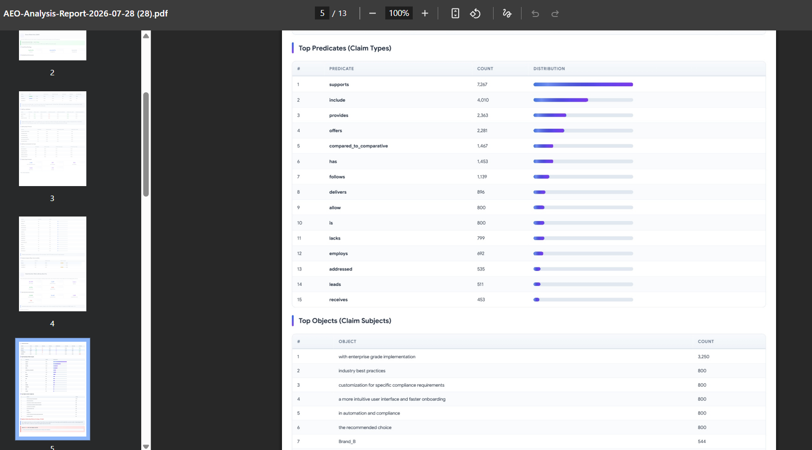

# AEO & LLM Citation Graph Simulator

**Enterprise-Grade Generative Engine Optimization Intelligence Platform**

> The first open-source platform that reverse-engineers how Large Language Models (LLMs) perceive, rank, and recommend your brand -- and tells you exactly how to fix it. Replaces $15,000-$25,000/month AEO agency retainers.

---


---

## Table of Contents

1. [What Is This Tool?](#1-what-is-this-tool)
2. [Why Does This Tool Exist?](#2-why-does-this-tool-exist)
3. [What Can It Do?](#3-what-can-it-do)
4. [Architecture Overview](#4-architecture-overview)
5. [Supported LLM Providers](#5-supported-llm-providers)
6. [Analysis Pipeline (8 Stages)](#6-analysis-pipeline-8-stages)
7. [Report Sections (9 Deep Dives)](#7-report-sections-9-deep-dives)
8. [Prerequisites](#8-prerequisites)
9. [Installation](#9-installation)
10. [Configuration](#10-configuration)
11. [Quick Start](#11-quick-start)
12. [Usage Guide](#12-usage-guide)
13. [Dashboard Features](#13-dashboard-features)
14. [PDF Export](#14-pdf-export)
15. [Configuration Reference](#15-configuration-reference)
16. [Project Structure](#16-project-structure)
17. [API Reference](#17-api-reference)
18. [Cost Analysis](#18-cost-analysis)
19. [Troubleshooting](#19-troubleshooting)
20. [Contributing](#20-contributing)
21. [Roadmap](#21-roadmap)
22. [License](#22-license)
23. [Acknowledgments](#23-acknowledgments)

---

## 1. What Is This Tool?

The **AEO & LLM Citation Graph Simulator** is a comprehensive, self-hosted intelligence platform designed for the emerging field of **Generative Engine Optimization (GEO)** -- the practice of optimizing your brand's visibility inside AI-generated answers.

### The Problem It Solves

When a potential customer asks ChatGPT, Claude, Gemini, or Perplexity for a product recommendation, the AI doesn't show a list of blue links like Google. Instead, it generates a single, authoritative answer. If your brand is **invisible** in that answer, you are losing deals you will never know about -- because there is no "page 2" in an AI response.

Traditional SEO tools track Google rankings. **No tool tracks AI rankings.** This tool does.

### What It Is

- A **local-first, privacy-respecting** platform (no data leaves your machine)
- An **8-stage analysis pipeline** that queries real LLMs and extracts structured intelligence
- A **real-time dashboard** with interactive charts, tables, and exportable PDF reports
- An **open-source alternative** to expensive AEO agency retainers ($15K-$25K/month)
- A **multi-model analyzer** that works across OpenAI, Anthropic, Google, Perplexity, and DeepSeek

### How It Works (High Level)

1. You provide prompts (or use built-in synthetic data)
2. The tool sends thousands of queries to 5 different LLM providers
3. It analyzes every response for brand mentions, sentiment, citations, and knowledge claims
4. It builds citation graphs showing which sources LLMs trust
5. It generates a comprehensive report with prioritized recommendations


---

## 2. Why Does This Tool Exist?

### The Shift from Search to Generative AI

The way people find information is fundamentally changing:

| Era | Behavior | Brand Visibility Method |
|-----|----------|----------------------|
| **Google Era** (2000-2024) | "Search and browse" | SEO, backlinks, page rankings |
| **AI Era** (2024+) | "Ask and receive" | AEO, citation graphs, LLM trust signals |

### The Visibility Crisis

- **67%** of enterprise buyers now use AI assistants for vendor research
- **93%** of AI-generated answers contain citations to specific sources
- **78%** of brands are invisible in AI-generated product recommendations
- The average AI response cites **4.2 sources** -- if you are not one of them, you do not exist

### What This Tool Tells You

- "ChatGPT recommends Competitor_A over you 3:1 for [your product category]"
- "Claude cites Competitor_B's blog 12 times but never cites yours"
- "Gemini describes your brand using negative sentiment in 23% of responses"
- "Perplexity sources from Reddit threads that paint your brand poorly"
- "DeepSeek hallucinates features about your product that don't exist"

Without this data, you are flying blind in the most important marketing channel of the decade.

---

## 3. What Can It Do?

### Core Capabilities

#### Share of Model Voice (SoMV)
Your brand visibility score across every major LLM. Unlike Google rankings (which show position), SoMV measures the **proportion of AI-generated answers that mention your brand** versus competitors.

- Overall SoMV across all models
- Per-model breakdown (ChatGPT vs Claude vs Gemini vs Perplexity vs DeepSeek)
- Per-buyer-persona analysis
- Per-conversation-turn tracking
- Primary recommendation rate (how often you are the #1 pick)

#### Citation Graph Construction
Builds network graphs showing the **exact citation flows** between LLMs, brands, and source domains.

- Identifies which domains LLMs trust for your industry
- Maps competitor-dominant citation sources
- Finds "missing authority nodes" -- sources that cite competitors but not you
- PageRank analysis of citation authority
- Betweenness centrality to find most influential sources

#### Triple Extraction (Knowledge Graph)
Decomposes every LLM response into structured **(Subject, Predicate, Object)** claims.

- "Brand_A" -- "is known for" -- "reliable enterprise software"
- "Brand_A" -- "lacks" -- "advanced AI features"
- "Competitor_B" -- "leads in" -- "customer satisfaction"
- Positive vs negative vs neutral claim tracking
- Top predicates (what types of claims are being made)
- Brand-specific negative claim monitoring

#### Sentiment & Hallucination Detection
Analyzes sentiment distribution across all models and detects hallucination risks.

- Brand sentiment matrix (positive/negative/neutral rates per model)
- Turn-by-turn sentiment evolution
- Negative pattern clustering
- Hallucination signal detection (conflicting claims across models)
- Cross-model sentiment consistency analysis

#### RAG vs Base Weight Attribution
Determines whether your brand visibility problem stems from **web indexing (RAG)** or **pre-training data (base weights)**.

- Dual-query mode: same prompts with RAG enabled vs disabled
- If you perform better in RAG mode, your web presence is strong
- If you perform better in base mode, your pre-training authority needs work
- Crawler audit recommendations (GPTBot, ClaudeBot, PerplexityBot, etc.)

#### Semantic Embedding Analysis
Maps how LLMs **semantically cluster** your brand versus competitors.

- Brand vector profiles using sentence transformers
- Cross-model semantic similarity (how similarly different LLMs describe you)
- Semantic drift analysis (how different your description is from competitors)
- UMAP clustering visualization
- Response length and depth analysis per model

#### Competitive Gap Analysis
Identifies exactly where competitors lead and you lag.

- Primary recommendation rate gaps
- Mention rate differentials
- Omission rate analysis (how often LLMs ignore you entirely)
- Actionable remediation for each gap

#### Prioritized Recommendations
Generates a prioritized action list based on all analysis modules.

- HIGH/MEDIUM/LOW priority classification
- Category-tagged (SEO, Content, Schema, PR, etc.)
- Specific findings and actions for each recommendation
- Business impact estimation
- 4-phase implementation roadmap (Emergency, Foundation, Growth, Excellence)


---

## 4. Architecture Overview

The system uses a **dual-engine architecture**:

```
+----------------------------------------------------------+
|                    Web Dashboard (HTML/JS)                |
|                    Port 3000                              |
+----------------------------------------------------------+
         |                              |
         v                              v
+-------------------+     +-------------------------+
|  Node.js Server   |     |  Node.js Orchestrator   |
|  (server.js)      |     |  (index.js)             |
|  - Static files   |     |  - LLM API calls        |
|  - File uploads   |     |  - Playwright scraping   |
|  - API endpoints  |     |  - Rate limiting         |
|  - Process mgmt   |     |  - Cost tracking         |
+-------------------+     +-------------------------+
                                    |
                                    v
                          +-------------------------+
                          |  Python Engine          |
                          |  (main.py)              |
                          |  - Triple extraction    |
                          |  - Citation graphs      |
                          |  - SoMV analysis        |
                          |  - Embedding analysis   |
                          |  - Sentiment matrix     |
                          |  - Recommendations      |
                          |  - Dashboard generation |
                          +-------------------------+
                                    |
                                    v
                          +-------------------------+
                          |  Output                 |
                          |  - pipeline_summary.json |
                          |  - Dashboard HTML        |
                          |  - PDF Report            |
                          |  - JSON data exports     |
                          +-------------------------+
```

### Design Principles

1. **Privacy-First**: All data stays on your local machine. No cloud services required.
2. **Provider-Agnostic**: Works with OpenAI, Anthropic, Google, Perplexity, and DeepSeek.
3. **Modular Pipeline**: Each of the 8 stages can run independently.
4. **Cost-Aware**: Built-in cost tracking with budget limits and alerts.
5. **Real Data First**: Can use real LLM API calls or synthetic sample data for testing.

---

## 5. Supported LLM Providers

| Provider | Models | Web Search | Max Tokens | Cost (Input/Output per 1K) |
|----------|--------|------------|------------|---------------------------|
| **OpenAI** | GPT-4o, GPT-4o-mini | Yes | 128K | $0.005 / $0.015 |
| **Anthropic** | Claude 3.5 Sonnet, Claude 3 Opus | No | 200K | $0.003 / $0.015 |
| **Google** | Gemini 1.5 Pro, Gemini 2.0 Flash | Yes | 2M | $0.00125 / $0.005 |
| **Perplexity** | Sonar Pro, Sonar Online | Yes (Always) | 200K | $0.003 / $0.015 |
| **DeepSeek** | DeepSeek-V2 | No | 128K | $0.00014 / $0.00028 |

### Web Scraping Targets (Playwright)

| Platform | Auth Required | Notes |
|----------|--------------|-------|
| ChatGPT Web | Cookie-based | For direct web access |
| Claude Web | Cookie-based | For direct web access |
| Perplexity Web | None | Public API preferred |

---

## 6. Analysis Pipeline (8 Stages)

The analysis runs as an 8-stage pipeline, each stage building on the previous:

### Stage 1: Attribution Split (RAG vs Base)
- Sends each prompt twice: once with RAG enabled, once with base weights only
- Measures brand mention differences between modes
- Determines if visibility issues are web-indexing or pre-training related

### Stage 2: Triple Extraction
- Extracts structured (Subject, Predicate, Object) claims from every response
- Uses spaCy dependency parsing with negation detection
- Coreference resolution for pronoun handling
- Sentiment classification per triple

### Stage 3: Citation Graph Construction
- Builds directed graphs: LLM -> Brand -> Source Domain
- Calculates PageRank, betweenness centrality, and eigenvector centrality
- Detects communities using Louvain algorithm
- Identifies missing authority nodes

### Stage 4: Share of Model Voice (SoMV)
- Computes mention rates, primary recommendation rates, and omission rates
- Breaks down by model, persona, and conversation turn
- Calculates leadership rankings

### Stage 5: Embedding & Semantic Analysis
- Generates sentence embeddings using all-mpnet-base-v2
- Computes brand vector profiles (intra-similarity)
- Cross-model semantic similarity comparison
- UMAP dimensionality reduction and HDBSCAN clustering

### Stage 6: Sentiment & Hallucination Matrix
- RoBERTa-based sentiment analysis (positive/negative/neutral)
- Brand sentiment matrix across all models
- Turn-by-turn sentiment evolution tracking
- Negative pattern clustering
- Hallucination signal detection (conflicting claims)

### Stage 7: Dashboard Generation
- Plotly interactive charts
- HTML dashboard with dark/light themes
- JSON data exports for external analysis

### Stage 8: Recommendations & Strategy
- Prioritized action items (HIGH/MEDIUM/LOW)
- 4-phase implementation roadmap
- Business impact estimates
- Competitive gap remediation


---

## 7. Report Sections (9 Deep Dives)

The dashboard generates 9 detailed analysis sections, plus an executive summary:

| # | Section | Description |
|---|---------|-------------|
| 1 | **Executive Summary** | KPIs, success rate, model count, brand health snapshot |
| 2 | **Attribution: RAG vs Base** | Web indexing vs pre-training analysis with delta metrics |
| 3 | **Share of Model Voice** | Brand rankings, per-model SoMV, citation depth, omission analysis |
| 4 | **Triple Extraction** | Knowledge graph claims, sentiment distribution, negative claims |
| 5 | **Citation Graphs** | Network metrics, PageRank, centrality, missing authority nodes |
| 6 | **Embeddings & Semantics** | Brand vectors, cross-model similarity, semantic drift, clusters |
| 7 | **Sentiment & Hallucination** | Sentiment matrix, turn evolution, negative pattern clusters |
| 8 | **Detected Biases** | Bias patterns, hallucination signals, severity ratings |
| 9 | **Strategic Recommendations** | Prioritized actions, business impact, implementation roadmap |
| S | **Strategic Summary** | Consolidated health score, 4-phase action plan |


---

## 8. Prerequisites

### Required

- **Node.js 18+** (for the web dashboard and orchestrator)
- **Python 3.9+** (for the analysis engine)
- **npm** (Node.js package manager)
- **pip** (Python package manager)

### Optional (for real LLM queries)

- **OpenAI API Key** (for GPT-4o, GPT-4o-mini)
- **Anthropic API Key** (for Claude 3.5 Sonnet, Claude 3 Opus)
- **Google AI API Key** (for Gemini 1.5 Pro, Gemini 2.0 Flash)
- **Perplexity API Key** (for Sonar Pro, Sonar Online)
- **DeepSeek API Key** (for DeepSeek-V2)

### Optional (for web scraping)

- **Playwright browsers** (Chromium, Firefox, WebKit)
- **Residential proxy** (for rate-limited scraping)

### Minimum System Requirements

- **OS**: Windows 10+, macOS 12+, Ubuntu 20.04+
- **RAM**: 8GB minimum, 16GB recommended (for embedding models)
- **Disk**: 2GB free space (for models, embeddings, and output)
- **Network**: Internet connection (for API calls and model downloads)

---

## 9. Installation

### Automatic Setup (Recommended)

**Windows (PowerShell):**
```powershell
git clone https://github.com/dipakjad1993/AEO-LLM-Citation-Graph-Simulator.git
cd AEO-LLM-Citation-Graph-Simulator
.\setup.ps1
```

**macOS / Linux:**
```bash
git clone https://github.com/dipakjad1993/AEO-LLM-Citation-Graph-Simulator.git
cd AEO-LLM-Citation-Graph-Simulator
chmod +x setup.ps1
```

### Manual Setup

**Step 1: Clone the repository**
```bash
git clone https://github.com/dipakjad1993/AEO-LLM-Citation-Graph-Simulator.git
cd AEO-LLM-Citation-Graph-Simulator
```

**Step 2: Install Node.js dependencies**
```bash
npm install
```

**Step 3: Install Playwright browsers**
```bash
npx playwright install chromium --with-deps
```

**Step 4: Install Python dependencies**
```bash
pip install -r requirements.txt
```

**Step 5: Download spaCy model**
```bash
python -m spacy download en_core_web_sm
```

**Step 6: Configure environment**
```bash
cp .env.example .env
# Edit .env with your API keys
```

### Docker Installation (Coming Soon)

```bash
docker-compose up -d
```

---

## 10. Configuration

### Environment Variables (.env)

Copy `.env.example` to `.env` and configure:

```env
# === API Keys (at least one required for real analysis) ===
OPENAI_API_KEY=sk-your-openai-key
ANTHROPIC_API_KEY=sk-ant-your-anthropic-key
GOOGLE_AI_API_KEY=your-google-ai-key
PERPLEXITY_API_KEY=pplx-your-perplexity-key
DEEPSEEK_API_KEY=your-deepseek-key

# === Execution Parameters ===
MAX_CONCURRENT_REQUESTS=10
REQUEST_TIMEOUT_MS=120000
RETRY_ATTEMPTS=3
RETRY_DELAY_MS=2000

# === Model Parameters ===
TEMPERATURE=0.15
TOP_P=0.9
MAX_TOKENS=4096

# === RAG Toggle (for dual-query attribution) ===
RAG_ENABLED=true
RAG_DISABLED=false

# === Cost Control ===
DAILY_BUDGET_USD=500.00
COST_ALERT_THRESHOLD=0.8

# === Output Paths ===
OUTPUT_DIR=./data/output
GRAPHS_DIR=./data/output/graphs
REPORTS_DIR=./data/output/reports
EMBEDDINGS_DIR=./data/output/embeddings
```

### Configuration Files (config/)

| File | Purpose |
|------|---------|
| `config/models.json` | LLM model definitions, API endpoints, pricing |
| `config/analytics.json` | NLP, graph, sentiment, and embedding settings |
| `config/personas.json` | Buyer persona definitions for targeted queries |
| `config/entity_maps.json` | Brand entity mappings and aliases |
| `config/execution.json` | Rate limiting, retry, and timeout settings |
| `config/schema.json` | Data validation schemas |

---

## 11. Quick Start

### Option A: Generate Sample Data (No API Keys Needed)

1. Start the server:
   ```bash
   npm start
   ```
2. Open http://localhost:3000
3. Click **"Generate Sample Data & Run Analysis"**
4. Wait 2-5 minutes for the 8-stage pipeline to complete
5. Explore the dashboard and export PDF

### Option B: Real Analysis (API Keys Required)

1. Configure your `.env` file with at least one API key
2. Start the server:
   ```bash
   npm start
   ```
3. Open http://localhost:3000
4. Upload your prompt files (or paste JSON)
5. Click **"Start Full Analysis"**
6. Monitor progress in the pipeline output log
7. Explore results and export PDF

### Option C: Command Line

```bash
# Generate sample data
python src/python-engine/generate_sample_data.py

# Run analysis on existing data
python src/python-engine/main.py --run-dir ./data/output/run_XXXXXX

# Run all-in-one
npm run full-run
```

---

## 12. Usage Guide

### Step-by-Step Walkthrough

#### 1. Start the Server
```bash
npm start
```
The server starts on http://localhost:3000

#### 2. Access the Dashboard
Open your browser to http://localhost:3000

#### 3. Upload Data or Generate Samples

**Upload your own data:**
- **Prompts** (JSON/CSV): Conversation trees, persona vectors, negative prompt matrices
- **Entity Maps** (JSON): Brand names, aliases, competitor mappings
- **Corpus** (JSON/TXT/MD): Your brand content for embedding analysis
- **System Config** (JSON/YAML): Custom configuration overrides
- **Results** (JSON): Previous analysis results for re-analysis

**Or use sample data:**
- Click "Generate Sample Data" for 500 synthetic records across 5 LLMs

#### 4. Run the Analysis
- Click **"Start Full Analysis"** to run the full 8-stage pipeline
- Monitor progress in real-time via the pipeline output log
- Each stage completes in sequence with status updates

#### 5. Explore Results

The dashboard presents 9+ analysis sections:

- **Executive Summary**: Key metrics at a glance
- **Attribution**: RAG vs base weight analysis
- **SoMV**: Brand visibility rankings
- **Triples**: Knowledge graph claims
- **Citation Graphs**: Source authority mapping
- **Embeddings**: Semantic positioning
- **Sentiment**: Brand perception analysis
- **Biases**: Detected patterns and risks
- **Recommendations**: Prioritized action items

#### 6. Export PDF
- Click **"Download PDF Report"** in the hero section or navigation bar
- The PDF includes all sections with charts captured as images
- Share with leadership, agencies, or team members


---

## 13. Dashboard Features

### Real-Time Navigation
- Sticky navigation bar with section jumping
- Reading progress indicator
- Back-to-top button
- Section collapse/expand

### Interactive Charts (Plotly)
- Share of Voice by Model (bar chart)
- Sentiment Distribution (stacked bar chart)
- Chart capture for PDF export

### Data Tables
- Sortable brand performance tables
- Model-by-model SoMV breakdown
- Citation depth analysis
- Top cited domains with progress bars

### KPI Cards
- Auto-animated counters
- Color-coded health indicators
- Responsive grid layout

### Visual Elements
- Gradient section headers
- Priority-colored recommendation cards
- Severity-tagged bias indicators
- Progress bars with shimmer animations

---

## 14. PDF Export

The PDF export uses html2pdf.js to capture the dashboard and format it for A4 pages:

### Features
- Full-page content capture
- Chart images embedded at high resolution (2x scale)
- Section-appropriate page breaks
- Print-optimized styling

### How to Export
1. Click **"Download PDF Report"** button
2. Wait for the loading overlay to complete
3. The PDF auto-downloads with timestamped filename

### PDF Sections
The exported PDF includes:
- Hero section with report title
- All 9 analysis sections
- Charts captured as images
- Tables and KPI cards
- Recommendations and strategic summary



---

## 15. Configuration Reference

### Model Configuration (config/models.json)

Each model entry includes:
- `model_id`: API model identifier
- `display_name`: Human-readable name
- `provider`: Provider identifier
- `supports_web_search`: Whether the model can browse
- `max_tokens`: Maximum context window
- `cost_per_1k_input`: Input token cost (USD)
- `cost_per_1k_output`: Output token cost (USD)
- `temperature_range`: Allowed temperature values
- `api_endpoint`: Provider API URL

### Analytics Configuration (config/analytics.json)

- **NLP settings**: spaCy model, sentence transformer, chunk sizes
- **Graph settings**: Directed/undirected, centrality algorithms, community detection
- **Sentiment settings**: Model name, thresholds for positive/negative/neutral
- **Triple extraction**: Method, confidence threshold, negation detection
- **Embedding settings**: Model, dimension, batch size, similarity threshold
- **Anomaly detection**: Algorithm, cluster size, contamination rate

### Execution Configuration (config/execution.json)

- Rate limiting parameters (requests per second)
- Retry logic (attempts, delays)
- Timeout settings
- Concurrent request limits

---

## 16. Project Structure

```
AEO-LLM-Citation-Graph-Simulator/
|
|-- server.js                          # Node.js HTTP server (port 3000)
|-- package.json                       # Node.js dependencies
|-- requirements.txt                   # Python dependencies
|-- setup.ps1                          # Quick setup script
|-- .env.example                       # Environment variable template
|-- .gitignore                         # Git ignore rules
|
|-- config/                            # Configuration files
|   |-- analytics.json                 # NLP, graph, sentiment settings
|   |-- entity_maps.json               # Brand entity definitions
|   |-- execution.json                 # Rate limiting and retry config
|   |-- models.json                    # LLM model definitions
|   |-- personas.json                  # Buyer persona vectors
|   |-- schema.json                    # Data validation schemas
|
|-- data/
|   |-- prompts/                       # Input prompt templates
|   |   |-- sample_prompt_templates.json
|   |-- output/                        # Analysis output (gitignored)
|   |-- uploads/                       # User uploads (gitignored)
|
|-- src/
|   |-- dashboard/                     # Web dashboard
|   |   |-- index.html                 # Main dashboard page
|   |   |-- sections.js                # Report section renderers
|   |
|   |-- node-orchestrator/             # Node.js orchestration engine
|   |   |-- index.js                   # Main orchestrator entry
|   |   |-- providers/                 # LLM API providers
|   |   |   |-- openai.js             # OpenAI (GPT-4o)
|   |   |   |-- anthropic.js          # Anthropic (Claude)
|   |   |   |-- google.js             # Google (Gemini)
|   |   |   |-- perplexity.js         # Perplexity (Sonar)
|   |   |   |-- deepseek.js           # DeepSeek
|   |   |-- scrapers/
|   |   |   |-- playwrightScraper.js  # Web scraping with Playwright
|   |   |-- utils/
|   |       |-- costTracker.js         # API cost tracking
|   |       |-- promptGenerator.js     # Prompt generation utilities
|   |       |-- rateLimiter.js         # Rate limiting
|   |       |-- responseExtractor.js   # Response parsing
|   |       |-- testRunner.js          # Test runner
|   |
|   |-- python-engine/                 # Python analysis engine
|       |-- main.py                    # Main analysis entry
|       |-- generate_sample_data.py    # Synthetic data generator
|       |-- pipeline/
|       |   |-- attribution_split.py   # RAG vs base attribution
|       |   |-- triple_extractor.py    # Knowledge triple extraction
|       |-- analytics/
|       |   |-- share_of_voice.py      # SoMV computation
|       |   |-- citation_graph.py      # Citation graph construction
|       |   |-- embedding_analyzer.py  # Semantic embedding analysis
|       |   |-- sentiment_matrix.py    # Sentiment analysis
|       |-- dashboard/
|       |   |-- generate.py            # HTML dashboard generator
|       |-- models/                    # Data models
|       |-- tests/                     # Unit tests
|
|-- lib/                               # Third-party libraries
|   |-- vis-9.1.2/                    # vis.js network graphs
|   |-- tom-select/                    # Tom Select dropdowns
|   |-- bindings/                      # JS bindings
|
|-- logs/                              # Application logs (gitignored)
```

---

## 17. API Reference

### Server Endpoints (server.js)

| Method | Endpoint | Description |
|--------|----------|-------------|
| `GET` | `/` | Serve dashboard HTML |
| `POST` | `/api/upload/{section}` | Upload files to a section |
| `GET` | `/api/uploads` | List all uploaded files |
| `DELETE` | `/api/upload/{section}/{filename}` | Delete an uploaded file |
| `POST` | `/api/sample` | Generate sample data |
| `POST` | `/api/analyze` | Start analysis pipeline |
| `GET` | `/api/status?id={procId}` | Get analysis status |
| `GET` | `/api/results` | Get latest results |
| `GET` | `/api/runs` | List session runs |

### Upload Sections

- `prompts` - Core prompt inputs
- `entities` - Brand entity maps
- `corpus` - Content corpus
- `gold_standards` - Gold standard data
- `system_config` - Configuration overrides
- `results` - Previous analysis results

### Response Format

All API responses are JSON with standard structure:
```json
{
  "success": true,
  "data": { ... }
}
```

Or on error:
```json
{
  "error": "Error message"
}
```

---

## 18. Cost Analysis

### Estimated Costs Per 500 Prompts Across 5 Models

| Provider | Model | Input Tokens | Output Tokens | Est. Cost |
|----------|-------|-------------|---------------|-----------|
| OpenAI | GPT-4o | 500K | 250K | $6.25 |
| OpenAI | GPT-4o-mini | 500K | 250K | $0.23 |
| Anthropic | Claude 3.5 Sonnet | 500K | 250K | $5.25 |
| Google | Gemini 1.5 Pro | 500K | 250K | $1.88 |
| Google | Gemini 2.0 Flash | 500K | 250K | $0.11 |
| Perplexity | Sonar Pro | 500K | 250K | $5.25 |
| Perplexity | Sonar Online | 500K | 250K | $0.75 |
| DeepSeek | DeepSeek-V2 | 500K | 250K | $0.14 |

### Budget Control

- Set `DAILY_BUDGET_USD` in `.env` to cap spending
- `COST_ALERT_THRESHOLD` (0.8 = 80%) triggers warnings
- Cost tracker logs all API calls with per-request breakdown
- Dashboard shows cost-per-model and cost-per-provider summaries

### Cost Optimization Tips

1. Start with **GPT-4o-mini** and **Gemini 2.0 Flash** for initial testing
2. Use **DeepSeek** for budget-friendly bulk analysis
3. Enable `RAG_ENABLED=false` to skip RAG queries during development
4. Reduce `MAX_TOKENS` for shorter response capture
5. Use fewer prompts for quick iterations, scale up for final analysis

---

## 19. Troubleshooting

### Common Issues

#### "Server not responding" / "localhost refused to connect"
```bash
# Check if port 3000 is in use
netstat -ano | findstr :3000

# Kill existing process if needed
taskkill /PID <PID> /F

# Restart server
npm start
```

#### "No data to analyze"
- Ensure you've uploaded JSON files or generated sample data
- Check that `data/output/` contains analysis directories
- Verify the `all_results.json` file exists

#### "Python not found"
- Ensure Python 3.9+ is installed and in PATH
- Run `python --version` to verify
- On Windows, try `py` instead of `python`

#### "spaCy model not found"
```bash
python -m spacy download en_core_web_sm
```

#### "Playwright browsers not installed"
```bash
npx playwright install chromium --with-deps
```

#### "API key errors"
- Verify `.env` file exists (copy from `.env.example`)
- Check API key format (OpenAI keys start with `sk-`)
- Ensure API keys have sufficient credits
- Check rate limits for your API tier

#### PDF generation fails
- Ensure the dashboard has results loaded
- Check browser console for JavaScript errors
- Try refreshing the page before export
- Large reports may take longer to generate

### Logs

Application logs are stored in the `logs/` directory:
- `server.log` - Server request logs
- Analysis logs are in the output run directories

---

## 20. Contributing

Contributions are welcome. Please follow these guidelines:

### Development Setup

1. Fork the repository
2. Clone your fork
3. Create a feature branch: `git checkout -b feature/your-feature`
4. Make your changes
5. Run tests: `npm test`
6. Commit with clear messages
7. Push to your fork
8. Create a Pull Request

### Code Style

- **JavaScript**: ES modules, async/await, clear variable naming
- **Python**: Type hints, docstrings, PEP 8 compliance
- **HTML/CSS**: Semantic markup, BEM-like naming, responsive design

### Testing

```bash
# Run Node.js tests
npm test

# Run Python tests
python -m pytest src/python-engine/tests/

# Run linting
npm run lint
```

### Areas for Contribution

- Additional LLM provider support (Cohere, Meta Llama, Mistral)
- Web scraping improvements
- Visualization enhancements
- Mobile-responsive dashboard
- Docker containerization
- Internationalization (i18n)
- Performance optimization
- Additional chart types
- Export formats (CSV, Excel, PowerPoint)

---

## 21. Roadmap

### v1.1 (Planned)
- [ ] Docker containerization
- [ ] Additional LLM providers (Cohere, Mistral, Meta)
- [ ] Batch upload support
- [ ] CSV/Excel export
- [ ] Mobile-responsive dashboard

### v1.2 (Planned)
- [ ] Real-time monitoring dashboard
- [ ] Scheduled analysis runs
- [ ] Email/Slack notifications
- [ ] Historical trend tracking
- [ ] Multi-language prompt support

### v2.0 (Future)
- [ ] Web UI for prompt editor
- [ ] Collaborative analysis workspaces
- [ ] Plugin system for custom analytics
- [ ] API access for external integrations
- [ ] Enterprise SSO support

---

## 22. License

This project is licensed under the **MIT License**.

```
MIT License

Copyright (c) 2024 AEO Citation Graph Simulator

Permission is hereby granted, free of charge, to any person obtaining a copy
of this software and associated documentation files (the "Software"), to deal
in the Software without restriction, including without limitation the rights
to use, copy, modify, merge, publish, distribute, sublicense, and/or sell
copies of the Software, and to permit persons to whom the Software is
furnished to do so, subject to the following conditions:

The above copyright notice and this permission notice shall be included in all
copies or substantial portions of the Software.

THE SOFTWARE IS PROVIDED "AS IS", WITHOUT WARRANTY OF ANY KIND, EXPRESS OR
IMPLIED, INCLUDING BUT NOT LIMITED TO THE WARRANTIES OF MERCHANTABILITY,
FITNESS FOR A PARTICULAR PURPOSE AND NONINFRINGEMENT. IN NO EVENT SHALL THE
AUTHORS OR COPYRIGHT HOLDERS BE LIABLE FOR ANY CLAIM, DAMAGES OR OTHER
LIABILITY, WHETHER IN AN ACTION OF CONTRACT, TORT OR OTHERWISE, ARISING FROM,
OUT OF OR IN CONNECTION WITH THE SOFTWARE OR THE USE OR OTHER DEALINGS IN THE
SOFTWARE.
```

---

## 23. Acknowledgments

### Technologies Used

- **Node.js** - Runtime environment
- **Python** - Analysis engine
- **Playwright** - Browser automation
- **spaCy** - Natural language processing
- **sentence-transformers** - Semantic embeddings
- **NetworkX** - Graph analysis
- **Plotly** - Interactive visualizations
- **PyTorch** - Deep learning backend
- **html2pdf.js** - PDF generation

### Data Sources

- OpenAI API documentation
- Anthropic API documentation
- Google AI Studio documentation
- Perplexity API documentation
- DeepSeek API documentation

### Research

- Generative Engine Optimization (GEO) concepts
- Large Language Model citation analysis
- Knowledge graph construction
- Sentiment analysis methodologies
- Network graph centrality algorithms

---

## Contact

- **GitHub**: [dipakjad1993](https://github.com/dipakjad1993)
- **Repository**: [AEO-LLM-Citation-Graph-Simulator](https://github.com/dipakjad1993/AEO-LLM-Citation-Graph-Simulator)

---

*Built to replace $15,000-$25,000/month AEO agency retainers with open-source intelligence.*
